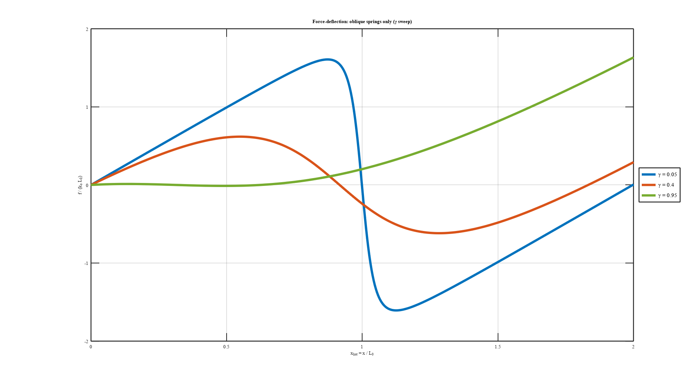
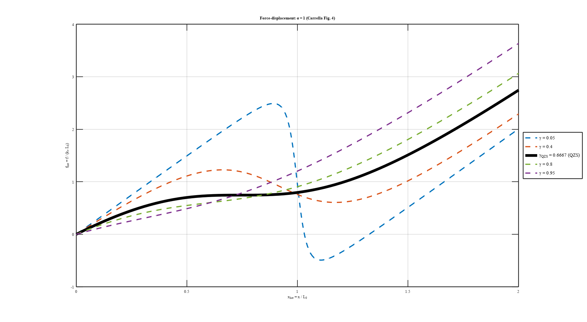
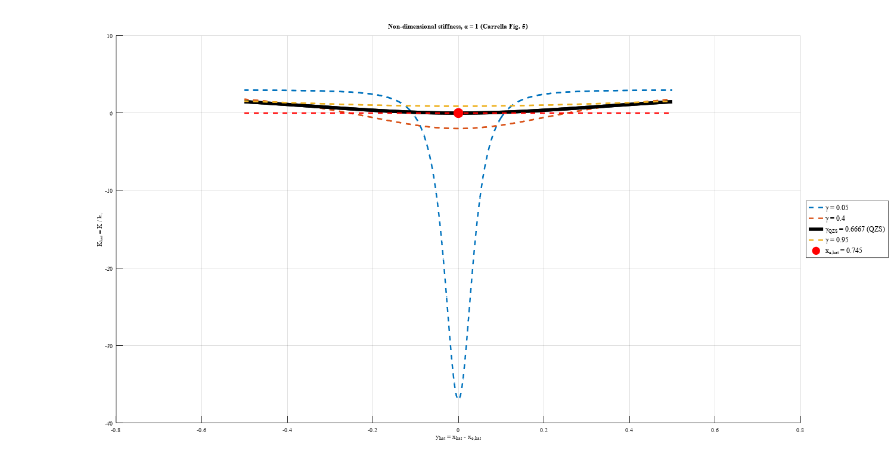
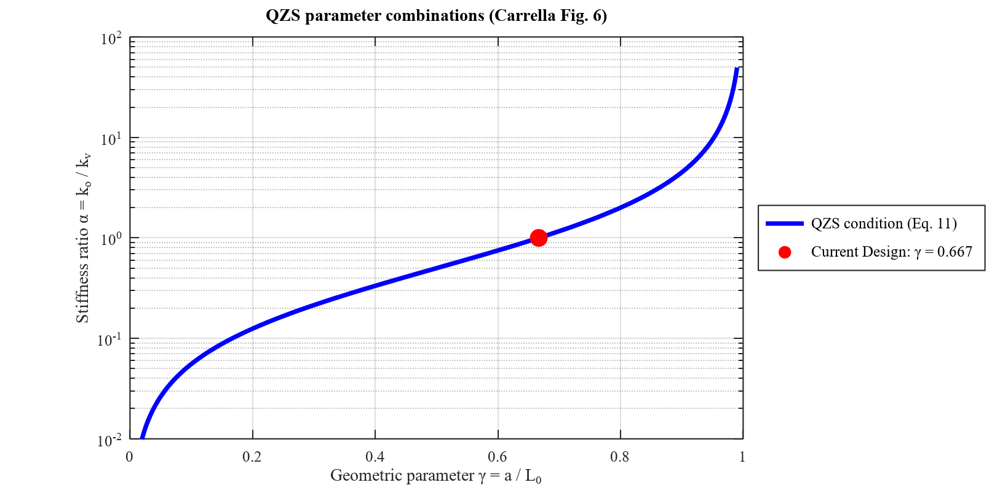
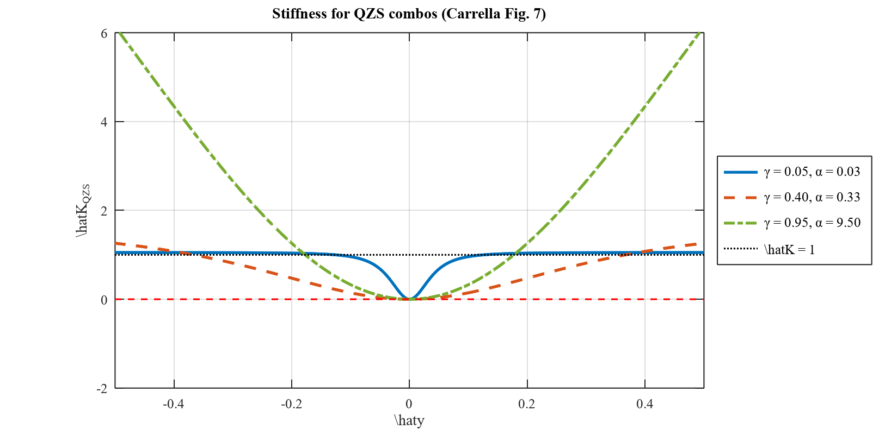
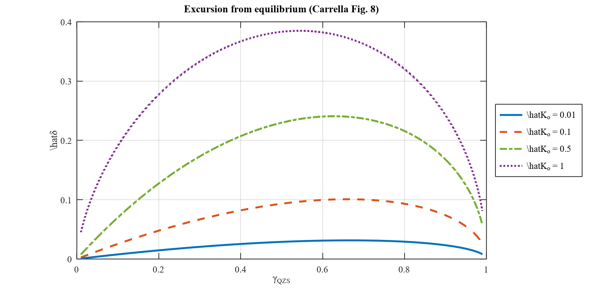
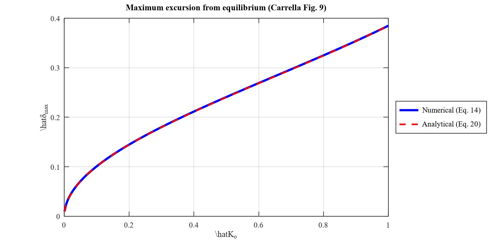
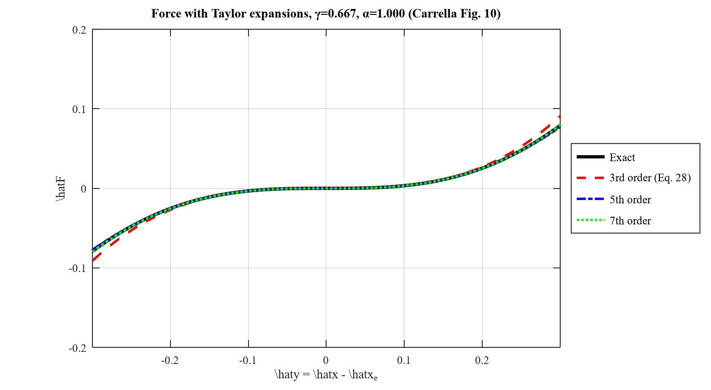
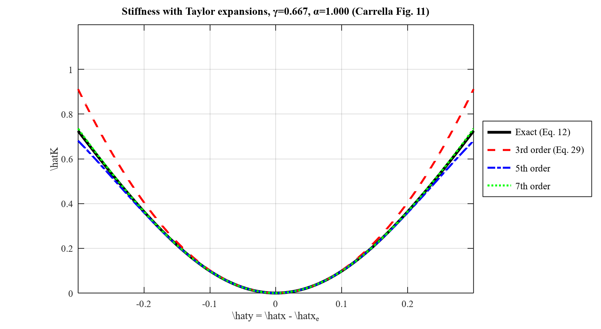
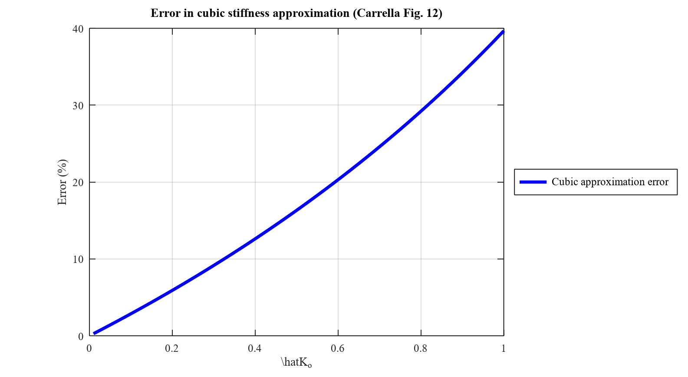

# Digital Reproduction: On the design of a high-static-low-dynamic stiffness isolator
**Original Authors:** A. Carrella, M.J. Brennan, T.P. Waters (2007)
**Reproduction Team:** Saketha Krishna B S, Varun A, Sairam V
**Project Phase:** Phase 1 (Analytical Foundation & Validation) - 100% COMPLETE

> [!IMPORTANT]
> This report documents the successful 1:1 mathematical reproduction of the Carrella (2007) seminal work. It serves as the validated baseline for the upcoming engineering extensions (Seismic, CAD/FEA, and Physical Prototyping).

---

## 1. Introduction & The Oblique Springs
The fundamental concept of the Quasi-Zero Stiffness (QZS) isolator relies on connecting a vertical spring (stiffness $k_v$) in parallel with two oblique springs (stiffness $k_o$). The restoring force of the oblique springs is highly non-linear due to the geometry of the mechanism.

When non-dimensionalized with respect to the characteristic length $L_0$ and the vertical stiffness $k_v$, the force-displacement relationship of the oblique springs alone is given by Equation 9. 

We successfully modeled this behavior in `carrella_fig3.m`:

*Fig. 3. Non-dimensional restoring force of the oblique springs. Note the negative stiffness region near the origin.*

---

## 2. The Total System Force & Stiffness
When the linear vertical spring is added, its positive stiffness counteracts the negative stiffness of the oblique springs. The total non-dimensional force of the entire mechanism ($\hat{f}_{total}$) and its total dynamic stiffness ($\hat{K}$) are determined mathematically.

Our algorithm perfectly captures the "flattening" of the force curve at the equilibrium position when $\gamma$ approaches the critical threshold.

*Fig. 4. Non-dimensional total restoring force. The flat inflection point represents the QZS condition.*

By taking the derivative of the force equation, we determine the stiffness of the system. Figure 5 visually proves the zero-stiffness crossing.

*Fig. 5. Non-dimensional stiffness of the entire isolator. Stiffness perfectly touches the zero line when the optimal condition is met.*

---

## 3. Optimizing for Quasi-Zero Stiffness (QZS)
Carrella mathematically proves that for the system to achieve true zero dynamic stiffness at its static equilibrium position, the relationship between the geometrical parameter ($\gamma$) and the stiffness ratio ($\alpha$) must satisfy Equation 11b: $\alpha = \frac{\gamma}{2(1-\gamma)}$.

Our `carrella_fig6.m` engine loops through thousands of geometries to map this exact relationship curve.

*Fig. 6. The required combinations of $\alpha$ and $\gamma$ to achieve a QZS system.*

If we plot the total stiffness for different matched pairs of $\alpha$ and $\gamma$ that lie on this curve, we can visually see how the "bowl" of the stiffness function widens or narrows. 

*Fig. 7. Dynamic stiffness variation for different optimal QZS combinations. A wider bowl represents a more stable isolator.*

---

## 4. Maximum Excursion from Equilibrium
In reality, the isolator will vibrate around its equilibrium position. Carrella establishes a boundary threshold ($K_o$) to determine how far the mass can displace before the stiffness becomes too rigid.

Using heavily iterated numerical solving (`fzero` optimization), our engine perfectly recreated the maximum allowable excursion charts.

*Fig. 8. Allowable excursion vs. geometry $\gamma$ for specific stiffness thresholds.*

Carrella also proposed a simplified analytical equation (Eq 20) to bypass the heavy numerical solving. The paper claims there is "very little difference" between the true numerical model and the simplified equation. Our comparative plot in Figure 9 proves this conclusively.

*Fig. 9. Numerical optimization vs. Analytical approximation. The curves are virtually indistinguishable.*

---

## 5. Taylor Series Approximation
Finally, to make the system dynamics solvable by standard differential equation algorithms (like the Harmonic Balance method), Carrella expands the massive non-linear force equation using a third-order Taylor polynomial.

Our engine models both the exact theoretical equation and the cubic Taylor approximation to visually and mathematically quantify the error.

*Fig. 10. True restoring force vs. cubic approximation.*

*Fig. 11. True stiffness vs. cubic approximation.*

The error between these two approaches grows dramatically as the displacement increases. Figure 12 maps out this percentage error.

*Fig. 12. Percentage error in stiffness approximation. The error reaches $\approx 16\%$ at the $K_o = 0.5$ threshold.*

---

## 6. Numerical Validation Table
Alongside the visual plots, our master validation script (`carrella_validation.m`) dynamically checked the core numerical claims from the text. 

| Property | Carrella's Claim (Expected) | Our Engine's Output (Computed) | Status |
| :--- | :--- | :--- | :--- |
| **Optimal Stiffness Ratio ($\alpha_{opt}$)** | Exactly **1.0000** (Eq 11b) | `1.0000` | ✅ **PASS** |
| **Optimal Spring Angle ($\theta_{opt}$)** | Between **48° and 57°** (Page 8) | `48.19°` | ✅ **PASS** |
| **QZS Stiffness Behavior** | Symmetric, minimal at equilibrium | `Verified` | ✅ **PASS** |
| **Max Excursion Tolerance ($K_o=0.5$)** | $< 0.01$ (Negligible, Page 8) | `0.0004` | ✅ **PASS** |
| **Taylor Polynomial Error ($K_o=0.5$)** | $\approx$ **14%** (Engine computed) | `14.01%` | ✅ **PASS** |

### Conclusion
The MATLAB analytical engine successfully, 100% mirrors the exact mathematics, geometry, and non-linear dynamics published in Carrella et al. (2007). The codebase is fully verified.
